# ProfPlan — System Architecture

> One diagram, one story. Everything the backend does — edge, API, async workers,
> data stores, the LLM fallback chain and observability — is in the single map
> below. The sections after it are the narration script: each numbered flow
> (①…⑧) is an edge you can point at while presenting.

- **Repository scope:** backend only (the React frontend lives in its own repo).
- **Style:** modular monolith, layered / Clean-Architecture-inspired
  (`presentation → application → domain → infrastructure`), Service pattern.
- **Runtime:** one Docker Compose file, one container per responsibility,
  two networks (`frontend` = edge, `backend` = internal — Postgres/Redis/Ollama
  are never exposed to the host).

---

> The decisions behind this shape, and what each one cost, are recorded in
> [`docs/adr/`](../adr/README.md). Read those before changing anything that
> looks backwards; several of them are, on purpose.

## The whole system in one diagram

> The diagram's **source of truth** is [`architecture.mmd`](./architecture.mmd);
> the block below is a copy of it. Everything else in this folder is generated
> from it — see [Diagram files](#diagram-files) for which one to open where.

```mermaid
%% ProfPlan — full backend architecture in one diagram.
%% Excalidraw-ready: paste into Excalidraw ➜ menu ➜ "Mermaid to Excalidraw".
%% Legend: solid = sync request/data · thick = synchronous LLM call
%%         dashed = async (queue, cache, telemetry, provider fallback)
%% Colors: blue = API · purple = async/Celery · green = data · orange = LLM · teal = observability

flowchart LR

%% ═══════════════════ EDGE ═══════════════════
subgraph EDGE["🌐 EDGE"]
  direction TB
  CLI["Client<br/>React (Vite) · Postman<br/>HttpOnly cookies<br/>+ X-CSRF-Token"]
  TRF["Traefik v3.3<br/>:80 → :443 TLS<br/>single entrypoint<br/>X-Forwarded-For<br/>dashboard :8080 off"]
  CLI -->|"HTTPS"| TRF
end

%% ═══════════════════ API ═══════════════════
subgraph API["⚙️ API — FastAPI (image profplan-backend)"]
  direction LR

  subgraph MW["Middleware — outermost ➜ innermost"]
    direction TB
    M1["SecurityHeaders<br/>CSP · nosniff · DENY<br/>HSTS in prod"]
    M2["RequestLogging<br/>1 JSON line/request<br/>user_id · latency · trace_id"]
    M3["Rate limit (slowapi)<br/>120/min · auth 10 · exp. 20<br/>counters in Redis"]
    M4["CSRF<br/>double-submit cookie<br/>unsafe methods"]
    M1 --> M2 --> M3 --> M4
  end

  subgraph MOD["Modules — router ➜ service (presentation · application · domain · infrastructure)"]
    direction TB
    DISP["APIRouter · prefix /api/v1<br/>uvicorn · UVICORN_WORKERS processes<br/>auth cookie required<br/>(except login / register)"]
    A_AUTH["auth · register login refresh logout logout-all me<br/>password-reset(+confirm) · email-verification(+confirm)<br/>AuthService — Argon2id · JWT 15min/30d<br/>rotating refresh + reuse detection · Redis lockout"]
    A_CRUD["domain CRUD · /subjects /plans /modules /academic-items<br/>/academic-item-categories /types /icons /colors<br/>GET /academic-items/{id}/handout.pdf — WeasyPrint<br/>Services — every query scoped to user_id · soft delete"]
    A_DOC["documents · POST upload → 202 · list · get · /status · delete<br/>UploadService — extension + MIME + magic bytes<br/>100 MB bounded read → 413"]
    A_RAG["rag · POST /rag/query<br/>RetrievalService — embed → cosine top-k<br/>ALWAYS scoped to owned content_ids"]
    A_AI["ai · POST /ai/ask · GET /ai/health · PATCH /ai/providers/{name}<br/>AiService — RAG context + prompt safety<br/>« untrusted_document_context »"]
    A_GEN["generation · POST /plans · POST /plans/{id}/generate<br/>GET /generations/{id}<br/>GenerationService — PlannerAgent + RoadmapReviewer<br/>plan (sync) → materialize → fan-out → poll"]
    A_AUD["audit · GET /audit-logs (admin)<br/>AuditRecorder — row staged in the SAME<br/>transaction as the business change"]
    A_OPS["ops · /health · /ready · /metrics · /docs · /static"]
    DISP --> A_AUTH
    DISP --> A_CRUD
    DISP --> A_DOC
    DISP --> A_RAG
    DISP --> A_AI
    DISP --> A_GEN
    DISP --> A_AUD
    DISP --> A_OPS
  end

  M4 ==> DISP
end

%% ═══════════════════ LLM ═══════════════════
subgraph LLM["🤖 LLM GATEWAY — one door for every AI call"]
  direction TB
  GW["LLMGateway<br/>semaphore LLM_MAX_CONCURRENCY=5<br/>skips providers disabled in ai_provider<br/>no DB connection held during the call"]
  CB["CircuitBreaker — state in Redis<br/>closed → open (3 fails) → half-open (30s)<br/>shared by every API/worker replica"]
  PC["1 · Anthropic Claude<br/>claude-sonnet-5"]
  PO["2 · OpenAI<br/>gpt-4o"]
  PGM["3 · Google Gemini<br/>gemini-2.5-flash"]
  PL["4 · Ollama (local)<br/>llama3.2:3b<br/>never disableable"]
  GW --- CB
  GW ==> PC
  PC -.->|"fail · no key · circuit open"| PO
  PO -.->|"fail"| PGM
  PGM -.->|"fail"| PL
  PL -.->|"all failed → 503"| GW
end

%% ═══════════════════ DATA ═══════════════════
subgraph DAT["🗄️ DATA & MODELS — internal network only"]
  direction TB
  PGB["PgBouncer :6432<br/>transaction pooling<br/>asyncpg prepared statements OFF"]
  PG["PostgreSQL 17 + pgvector<br/>users · providers · user_providers · refresh_tokens<br/>auth_logs · audit_logs · subjects · plans · modules<br/>academic_items · academic_item_category(+_types)<br/>icons · colors · verification_tokens<br/>document · document_content · document_format<br/>plan_generation · plan_document · ai_provider<br/>chunks vector(1024) · HNSW cosine<br/>SQLAlchemy 2.0 async · Alembic migrations"]
  RDS["Redis 8<br/>db0 cache · db1 Celery broker · db2 results<br/>db3 rate limit · login lockout<br/>embedding cache (7d) · circuit-breaker keys"]
  MIO["MinIO — S3<br/>bucket profplan<br/>raw files: {subject_id}/{uuid}.ext"]
  OLL["Ollama<br/>bge-m3 embeddings (1024-d)<br/>llama3.2:3b chat fallback"]
  MAIL["Mailpit :8025<br/>SMTP :1025 — dev inbox"]
  ADM["Adminer :8081 — DB UI, dev profile"]
end

%% ═══════════════════ ASYNC ═══════════════════
subgraph ASY["🧵 ASYNC — Celery worker (same image as the API)"]
  direction TB
  WRK["Celery worker · task_acks_late · prefetch 1<br/>retry 15s → 30s → 60s → FAILED<br/>NullPool engine (event-loop safe)"]
  subgraph PIPE["task documents.ingest — RAG pipeline · INDEXED = no-op, PROCESSING taken over when stale"]
    direction LR
    P1["fetch object"] --> P2["parse → Markdown<br/>pdf·docx·pptx<br/>xlsx·txt·md"] --> P3["header-aware chunking<br/>~1000 chars + overlap<br/>total published"] --> P4["embed bge-m3 (1024-d)<br/>batches of 8 · 300s each<br/>count published per batch"] --> P5["index in pgvector<br/>status → INDEXED<br/>failure → FAILED + reason"]
  end
  GENT["task generation.run_item — one per academic item<br/>RAG context → LLM → content.markdown<br/>recompute run → RUNNING / COMPLETED / PARTIAL"]
  MAILT["task emails.send<br/>password reset · email verification"]
  FLW["Flower :5555 — task/queue/failure monitor"]
  WRK --> P1
  WRK --> GENT
  WRK --> MAILT
end

%% ═══════════════════ OBSERVABILITY ═══════════════════
subgraph OBS["📈 OBSERVABILITY — profile: observability"]
  direction LR
  OTC["OTel Collector<br/>OTLP :4317 / :4318"] --> TMP["Tempo<br/>traces"]
  PTL["Promtail<br/>docker socket"] --> LOK["Loki<br/>logs"]
  NEX["node-exporter<br/>host CPU/mem/disk"] --> PRM["Prometheus :9090<br/>metrics · alert rules"]
  TMP --> GRF["Grafana :3000<br/>metrics + logs + traces<br/>datasources provisioned"]
  LOK --> GRF
  PRM --> GRF
  PRM -->|"fired alerts"| ALM["Alertmanager :9093<br/>routing · inhibit · Watchdog"]
end

%% ═══════════════════ FLOWS ═══════════════════
TRF ==>|"Host: api.localhost"| M1

A_AUTH -->|"① users · refresh_tokens · auth_logs"| PGB
A_AUTH -.->|"① login attempt counter"| RDS
A_AUTH -.->|"① enqueue emails.send"| RDS
MAILT  -->|"SMTP"| MAIL
A_CRUD -->|"② owner-scoped SQL"| PGB
A_AUD  -->|"⑧ audit_logs (same transaction)"| PGB

A_DOC  -->|"③ put_object"| MIO
A_DOC  -->|"③ document row = PENDING"| PGB
A_DOC  -.->|"③ enqueue documents.ingest"| RDS
RDS    -.->|"③ ④ deliver task"| WRK
P1     -->|"③ file bytes"| MIO
P4     -->|"③ /api/embed"| OLL
P4     -.->|"③ embedding cache"| RDS
P5     -->|"③ document_content + chunks"| PG

A_GEN  ==>|"④ planner: draft → eval → repair"| GW
A_GEN  -->|"④ plan_generation + modules + items (PENDING)"| PGB
A_GEN  -.->|"④ fan-out: 1 task per item"| RDS
GENT   ==>|"④ generate item"| GW
GENT   -->|"④ item content + run status"| PG

A_RAG  -->|"⑤ embed question"| OLL
A_RAG  -->|"⑤ cosine top-k over chunks"| PGB
A_AI   ==>|"⑥ answer grounded in context"| GW
CB     -.->|"⑥ breaker keys"| RDS

M2     -.->|"⑦ OTLP spans (OTEL_ENABLED)"| OTC
WRK    -.->|"⑦ OTLP spans"| OTC
M2     -.->|"⑦ stdout JSON logs"| PTL
WRK    -.->|"⑦ stdout JSON logs"| PTL
A_OPS  -.->|"⑦ /metrics scrape"| PRM
FLW    -.-> RDS
PGB    -->|"pooled sessions"| PG
ADM    -.-> PG

%% ═══════════════════ STYLE ═══════════════════
classDef edge  fill:#eef2f7,stroke:#64748b,stroke-width:2px,color:#0b1220
classDef api   fill:#e8efff,stroke:#2563eb,stroke-width:2px,color:#0b1220
classDef asyn  fill:#f2ecff,stroke:#7c3aed,stroke-width:2px,color:#0b1220
classDef data  fill:#e7f6ef,stroke:#0f766e,stroke-width:2px,color:#0b1220
classDef llm   fill:#fff0e6,stroke:#ea580c,stroke-width:2px,color:#0b1220
classDef obs   fill:#e6f7f7,stroke:#0d9488,stroke-width:2px,color:#0b1220

class CLI,TRF edge
class DISP,M1,M2,M3,M4,A_AUTH,A_CRUD,A_DOC,A_RAG,A_AI,A_GEN,A_AUD,A_OPS api
class WRK,P1,P2,P3,P4,P5,GENT,MAILT,FLW asyn
class PGB,PG,RDS,MIO,OLL,MAIL,ADM data
class GW,CB,PC,PO,PGM,PL llm
class OTC,TMP,PTL,LOK,PRM,ALM,NEX,GRF obs
```



**Reading the diagram**

| Notation | Meaning |
|---|---|
| `──▶` solid | synchronous request / data access (the caller waits) |
| `══▶` thick | synchronous **LLM** call (the expensive path) |
| `- - ▶` dashed | asynchronous: queue enqueue/deliver, cache, telemetry, fallback |
| ①…⑧ | the eight flows narrated below |
| Colors | blue = API · purple = async/Celery · green = data · orange = LLM · teal = observability |

---

## Diagram files

| File | Open it in | Notes |
|---|---|---|
| [`architecture.mmd`](./architecture.mmd) | Mermaid (docs, GitHub, this file) | **Source of truth.** Grouped with `subgraph`, so it renders best. |
| [`architecture.svg`](./architecture.svg) · [`architecture.png`](./architecture.png) | Slides, print | Rendered from the `.mmd` (SVG is vector — zoom without blur; PNG is 4800 px). |
| [`architecture.excalidraw`](./architecture.excalidraw) | **Excalidraw** (File ➜ Open) | Ready-made scene: 47 boxes, 60 bound arrows, one named frame per layer. |
| [`architecture-excalidraw.mmd`](./architecture-excalidraw.mmd) | Excalidraw ➜ ☰ ➜ *Mermaid to Excalidraw* | Same diagram in the subset the importer actually supports (see below). |
| [`generate_excalidraw.py`](./generate_excalidraw.py) | `python3 generate_excalidraw.py` | Rebuilds the `.excalidraw` scene from the Excalidraw `.mmd`. |

**Why two Mermaid files.** Excalidraw's *Mermaid to Excalidraw* converter cannot
handle three things this diagram uses, and it fails silently — it drops back to
pasting one flat, uneditable **image** instead of shapes:

1. **`subgraph`** — any subgraph raises `SubGraph element not found`. That alone
   is what turns the import into an image.
2. **`%%` comments** — they get concatenated and break the parser.
3. **`<br/>`** — printed literally as text; line breaks have to be written as
   Mermaid markdown strings (backticks) instead.

So `architecture-excalidraw.mmd` has no subgraphs, no comments and backtick
labels. The trade-off is layout: without subgraphs the auto-layout scatters the
boxes, which is exactly what `generate_excalidraw.py` fixes — it reads that file
and lays the nodes out in layered columns with a frame per layer.

**Going deeper than the map.** [`docs/study/`](../study/) holds a 45-page LaTeX
guide to every technology on this diagram — what it is, how it works, what it
does *here*, a 30-second explanation of each, and the follow-up questions.
Build it with `pdflatex profplan-tech-guide.tex` (twice).

Regenerate everything after editing the diagram:

```bash
cd docs/architecture
npx @mermaid-js/mermaid-cli -i architecture.mmd -o architecture.svg
npx @mermaid-js/mermaid-cli -i architecture.mmd -o architecture.png -w 4800 -b white
python3 generate_excalidraw.py     # after mirroring the change in the Excalidraw .mmd
```

---

## Narration script

### ① Authentication — cookie-based JWT
`POST /auth/login` → `AuthService` verifies the **Argon2id** hash, issues an
access JWT (15 min) and a refresh JWT (30 days) as **HttpOnly + Secure +
SameSite** cookies. Only the SHA-256 **hash** of the refresh token is stored
(`refresh_tokens`). Every refresh **rotates** the token: the old session is
revoked, and presenting a revoked one triggers **reuse detection** → all the
user's sessions are killed. Failed logins increment a per-account counter in
Redis (lockout after 5 in 5 min); every event lands in `auth_logs`.
There is no `Authorization: Bearer` header and no token in `localStorage` —
which is exactly why the CSRF middleware exists (④ of the middleware chain).

### ② Domain CRUD — owner-scoped by construction
`subjects → plans → modules → academic_items` is the teaching hierarchy;
`icons`, `colors`, `academic_item_category(_types)` are global catalogs.
`user_id` never comes from the request body — it comes from the authenticated
user, and **every** repository query filters by it, so one teacher can never
read another's data. Deletes are soft (`deleted_at`). All schema changes go
through **Alembic** — never by hand.

### ③ Document ingestion (RAG write path) — the async pipeline
`POST /documents` (multipart) validates the file **before** persisting anything:
extension allow-list + declared MIME + **real magic bytes** (a renamed `.exe` is
rejected), with a bounded read so a huge upload can't exhaust memory (413).
The bytes go to **MinIO**, a `document` row is created `PENDING`, the request
returns **202**, and a Celery task is enqueued.
The worker then runs: **fetch → parse to Markdown → header-aware chunking →
embed with bge-m3 → index in pgvector**, and only then flips the status to
`INDEXED`.

Embedding is the slow step and it goes in **batches of 8**, each its own
request with its own timeout. That is not about speed, which the model decides
(about five seconds a chunk on a CPU), but about finishing: one request
carrying every chunk of a long document could not complete inside any sane
timeout, so large documents never indexed at all. The chunk total is published
once the text is chunked and the count after each batch, which is what lets the
page show real progress and an estimate measured from the rate the machine is
actually managing.

The task is **idempotent**: a redelivery for a document already `INDEXED` is a
no-op, and one still `PROCESSING` is left alone *while someone is on it*. Past
a staleness threshold it is taken over, because a run killed by a timeout or a
reboot leaves a `PROCESSING` row nobody is working on, and skipping it was what
made a failed ingestion permanent. A failure now always lands in `FAILED` with
its reason, which is both what the page reads and what tells the retry it may
take the work. Transient failures retry with backoff (15/30/60s).

### ④ Plan generation — sync planner, async fan-out
`POST /plans` is the flagship flow, in this exact order:

1. **Validate** the selected documents belong to the user (they scope the RAG
   context to that plan's material).
2. **Planner agent runs synchronously, before anything is persisted** —
   `draft → evaluate → repair`. Code checks always run; the **LLM judge** only
   runs when the code checks flag something or the retrieved context was too
   weak. A clean plan still costs exactly **one** LLM call; worst case, three.
   If the AI can't produce a valid `Roadmap`, the request fails 502/503 and
   **no orphan rows are left behind**.
3. **Materialize**: persist `plan_generation` (status `RUNNING`) + one `module`
   per roadmap module (the period is split into contiguous date ranges) + one
   `academic_item` per planned item, each `PENDING` with its own sub-prompt.
4. **Fan out**: one `generation.run_item` Celery task per item. Each worker
   retrieves its own RAG context, calls the gateway and writes back
   `content.markdown`, then recomputes the run:
   `RUNNING → COMPLETED` (all ok) / `PARTIAL` (some failed) / `FAILED`.
5. **Poll** `GET /generations/{id}` and watch the items fill in.

### ⑤ Retrieval (RAG read path)
`POST /rag/query` embeds the question with bge-m3 and runs a **cosine** search
over `chunks` (HNSW index). The search is **always** scoped to content ids the
user owns — `ChunkRepository.search_similar` refuses to run without a scope.
That is the tenant-isolation guarantee, enforced in the repository, not in a
caller that could forget.

### ⑥ LLM gateway — fallback chain + circuit breaker
One component fronts every AI call: **Claude → OpenAI → Gemini → Ollama**.
Each provider is wrapped in a **circuit breaker whose state lives in Redis**, so
every API and worker process shares one view of "this provider is down" instead
of each hammering a dead endpoint. A provider with no key, disabled by an admin
(`ai_provider` table), or with an open circuit is skipped. Outbound calls are
capped by a process-wide semaphore, and the request **does not hold a pooled DB
connection** during the LLM call — a fallback chain can run for minutes and
would otherwise starve every other route. If all four fail: `503`.
Runtime control: `GET /ai/health` (per-provider status), `PATCH
/ai/providers/{name}` (admin). Two invariants: Ollama can never be disabled, and
at least one non-Ollama provider must stay active. **API keys are never stored
in the DB** — they stay in the environment.

### ⑦ Observability — three signals, one pane
Every process logs single-line **JSON** to stdout; **Promtail** ships it to
**Loki**. `RequestLoggingMiddleware` puts the acting user and the **`trace_id`**
on each request line, so a log jumps straight to its span. Traces are opt-in
(`OTEL_ENABLED`) and auto-instrument FastAPI, SQLAlchemy, Redis, httpx and
Celery → **OTel Collector → Tempo**; context propagates through the Redis
broker, so an upload and its background ingestion appear in **one trace**.
**Prometheus** scrapes `/metrics` and **node-exporter**, and evaluates the
alert rules in `docker/prometheus/rules/`; anything that fires goes to
**Alertmanager**, which routes it and suppresses the noise a single outage
would otherwise produce (a Watchdog alert fires permanently, so silence from
the alerting path is itself detectable). **Grafana** has all three datasources
pre-provisioned. **Flower** covers what Prometheus can't: per-task detail.

### ⑧ Audit trail
`AuditRecorder` stages an `audit_logs` row **inside the caller's own
transaction**, right before its `commit()` — so the business change and its
audit entry are atomic: no change without a trail, no trail without a change.
Snapshots are JSON-safe by construction (serialization can never break the
business transaction) and never copy `password_hash`.

---

## Cross-cutting guarantees (the middleware chain, top of the diagram)

Starlette runs the **last-added** middleware first, so the effective order is:

```
SecurityHeaders → RequestLogging → SlowAPI (rate limit) → CSRF → route
```

Security headers therefore decorate **every** response (including 429s), and the
logger records rate-limited requests too. CSRF sits innermost — it only needs
the request's own cookies/headers.

| Concern | Defense |
|---|---|
| Clickjacking / XSS / sniffing | CSP (`default-src 'none'` for the JSON API), `X-Frame-Options: DENY`, `nosniff`, `Referrer-Policy`, HSTS in production |
| CSRF | Non-HttpOnly `csrf_token` cookie mirrored into `X-CSRF-Token` on unsafe methods (403 otherwise); skipped when there's no session at all |
| Credential stuffing | Per-account Redis login lockout |
| DoS / floods | Per-IP slowapi limits (Redis-backed, so they hold across replicas); probes exempt |
| Malicious uploads | Extension + MIME + magic bytes + size cap; files are stored and parsed, never executed |
| Prompt injection | Retrieved text wrapped in `<untrusted_document_context>`; every system prompt treats it as data, never as commands |
| Tenant leakage | Search refuses to run unscoped; all queries filtered by `user_id` |
| SQL injection | 100% ORM with bound parameters (only raw statement: `SELECT 1` readiness probe) |
| Supply chain | Dependabot + blocking CI `pip-audit` and `gitleaks` |
| Container | Non-root API/worker image |

CORS is a **development-only** concern: in production everything is served
behind Traefik on a single origin, so the middleware isn't even added.

---

## Deployment topology

```
docker compose --profile dev up --build                     # core + adminer
docker compose --profile production up -d                   # core only
docker compose --profile dev --profile observability up -d  # everything
```

| Profile | Containers |
|---|---|
| `dev` / `production` | traefik · api · worker · flower · postgres · redis · minio · ollama (+ adminer on `dev`) |
| `observability` | otel-collector · tempo · promtail · loki · prometheus · node-exporter · grafana |
| `tools` | lint (Ruff) · test (pytest) |

Networks: **`frontend`** (Traefik ↔ API) and **`backend`** (internal).
Postgres, Redis and Ollama are not published to the host. Named volumes persist
Postgres, Redis, MinIO and Grafana.

**Measured capacity:** on a single 1-CPU API container, ~**750 simultaneous
real users** (a click every 5–10s) at p95 545 ms with zero failures; first
errors around 1000. The invariant is ~120–180 req/s per saturated core. The
real ceiling to raise next is API workers + PgBouncer, not the application code.

---

## Key knobs (`.env`)

| Group | Variables |
|---|---|
| Auth | `ACCESS_TOKEN_EXPIRE_MINUTES` · `REFRESH_TOKEN_EXPIRE_DAYS` · `COOKIE_SECURE` · `COOKIE_SAMESITE` · `LOGIN_RATE_LIMIT_*` |
| Rate limit | `RATE_LIMIT_ENABLED` · `RATE_LIMIT_DEFAULT` / `_AUTH` / `_EXPENSIVE` |
| Uploads | `MAX_UPLOAD_SIZE_MB` (default 100) |
| RAG | `EMBEDDING_MODEL=bge-m3` · `OLLAMA_BASE_URL` · `EMBEDDING_CACHE_TTL_SECONDS` |
| LLM | `ANTHROPIC_*` · `OPENAI_*` · `GEMINI_*` · `OLLAMA_CHAT_MODEL` · `LLM_TIMEOUT_SECONDS` · `LLM_MAX_CONCURRENCY` · `LLM_CIRCUIT_*` |
| Generation | `PLAN_GENERATION_ENABLED` · `PLANNER_EVAL_ENABLED` · `PLANNER_WEAK_CONTEXT_DISTANCE` |
| Telemetry | `OTEL_ENABLED` · `OTEL_EXPORTER_OTLP_ENDPOINT` · `LOG_LEVEL` |

---

## Where things live

| Path | Contents |
|---|---|
| `app/main.py` | App bootstrap, middleware order, probes, `/metrics` |
| `app/api/` | Router aggregation + cross-cutting middleware (CSRF, rate limit, security headers, exception handlers) |
| `app/modules/<feature>/` | `presentation/` · `application/` · `domain/` · `infrastructure/` |
| `app/infrastructure/` | Celery, database session, Redis, MinIO, telemetry |
| `app/shared/` | Prompt safety, JSON extraction, retry decorator, soft delete, base errors |
| `alembic/versions/` | Migrations (the only way to change the schema) |
| `docker/` | Per-service configs (traefik, prometheus, loki, tempo, otel, grafana, promtail) |
| `perf/` | Locust load test + captured baseline |
