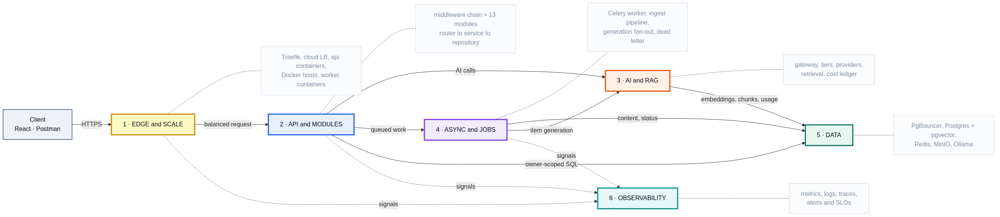
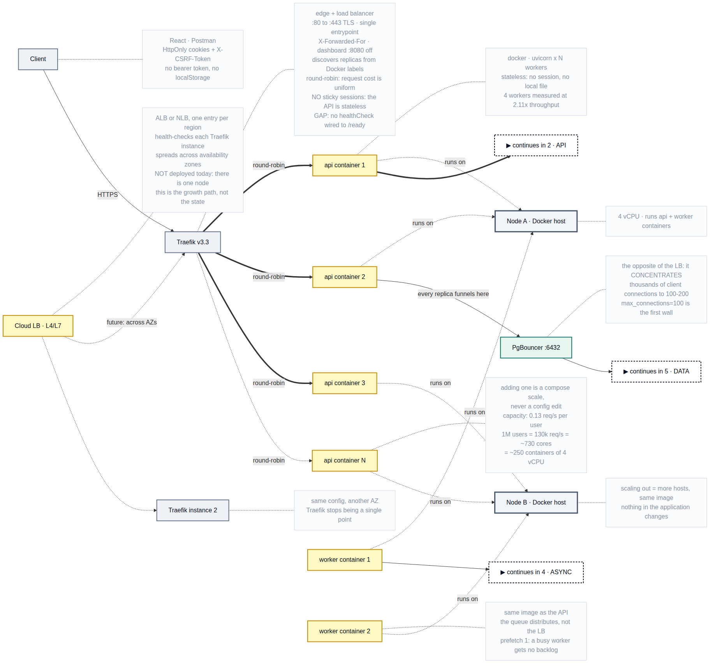
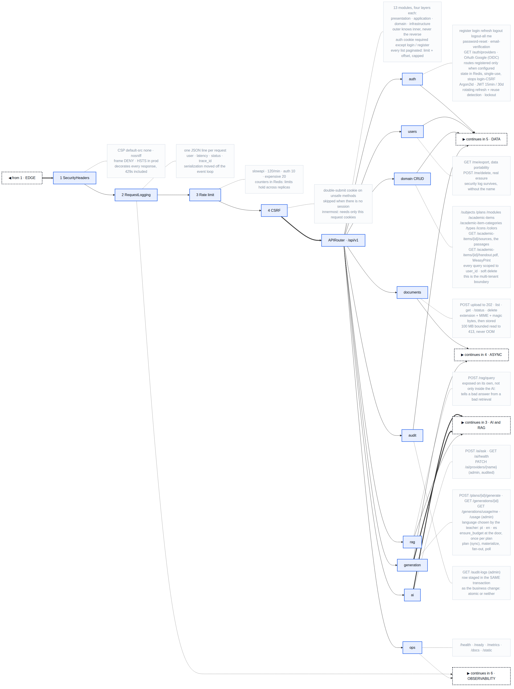
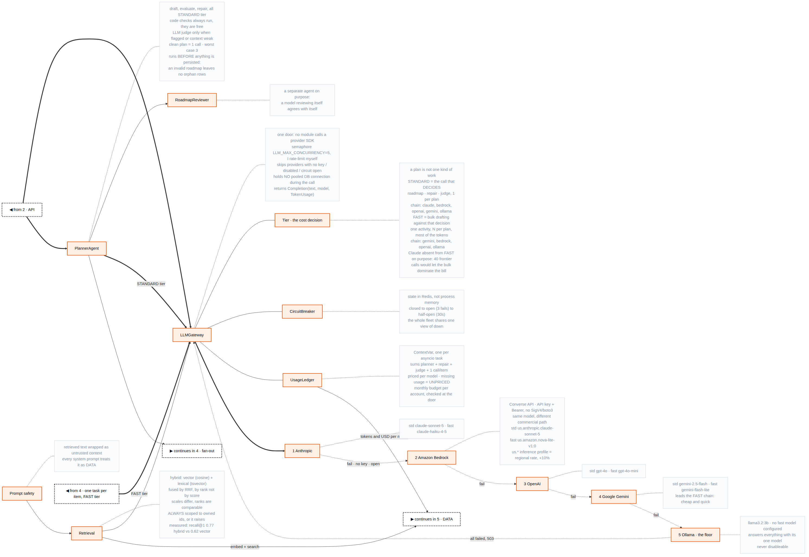
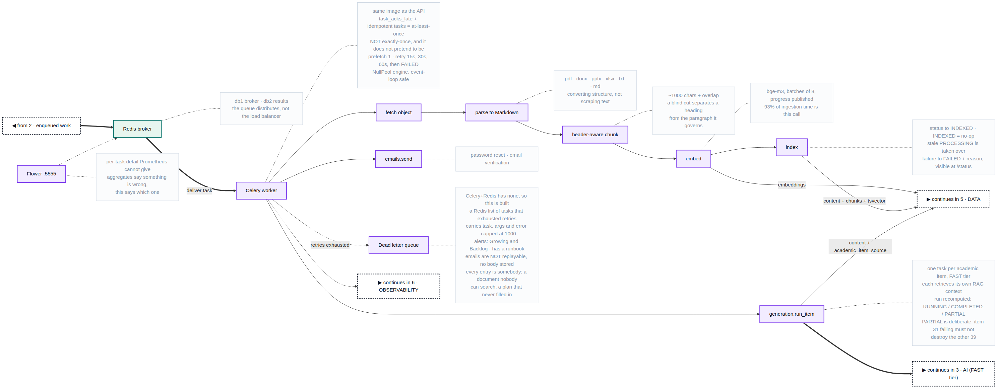
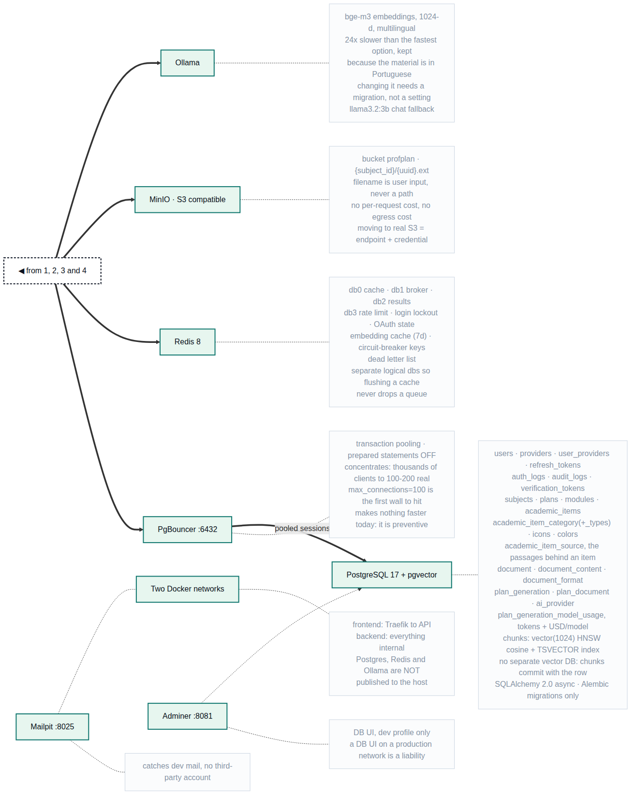
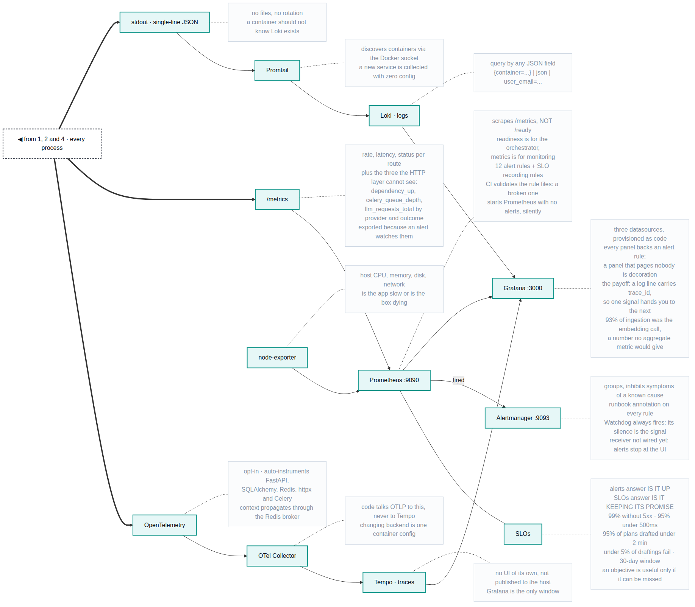
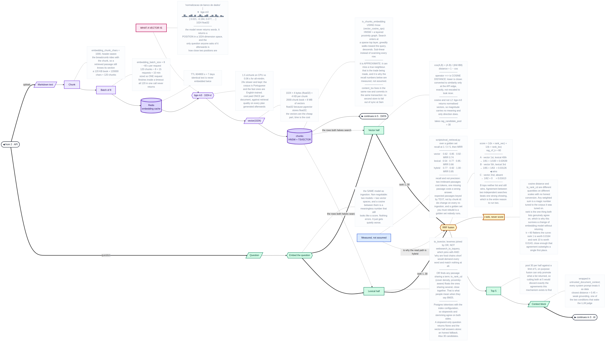

# ProfPlan — System Architecture

> Eight diagrams, one story. Everything the backend does — edge, API, async
> workers, data stores, the LLM fallback chain and observability — is split by
> stage below, and the dashed boxes at the seams say which diagram a flow
> continues in. The sections after them are the narration script: each numbered
> flow (①…⑧) is an edge you can point at while presenting.

- **Repository scope:** backend only (the React frontend lives in its own repo).
- **Style:** modular monolith, layered / Clean-Architecture-inspired
  (`presentation → application → domain → infrastructure`), Service pattern.
- **Runtime:** one Docker Compose file, one container per responsibility,
  two networks (`frontend` = edge, `backend` = internal — Postgres/Redis/Ollama
  are never exposed to the host).

---

> The decisions behind this shape, and what each one cost, are recorded in
> [`docs/adr/`](../adr/README.md). Read those before changing anything that
> looks backwards; several of them are, on purpose.

## The architecture, in eight diagrams
> One big picture stopped being readable at about a hundred nodes, so it is split by
> stage. Diagram **0** is the map; **1** to **7** are the detail. The dashed boxes
> marked `◀ from` and `▶ continues in` are the seams: every arrow that leaves one
> diagram arrives in another.

> All eight are plain Mermaid with no `subgraph`, no `%%` comments and no frontmatter,
> so each one pastes straight into Excalidraw.

### The whole system in eight diagrams

The six blocks and how a request moves between them. Every arrow here is a handoff you can follow into the detail diagrams below.



Source: [`architecture-0-overview.mmd`](./architecture-0-overview.mmd)

### 1 · Edge and scale

Where a request lands, how it is balanced across Docker containers and hosts, and where everything funnels back together.



Source: [`architecture-1-edge.mmd`](./architecture-1-edge.mmd)

### 2 · API and modules

The middleware chain in the order it actually runs, and the thirteen modules behind the router.



Source: [`architecture-2-api.mmd`](./architecture-2-api.mmd)

### 3 · AI and RAG

The one door every AI call goes through: tiers, providers, the planner and its reviewer, retrieval, and what each call cost.



Source: [`architecture-3-ai.mmd`](./architecture-3-ai.mmd)

### 4 · Async and jobs

The ingestion pipeline, the generation fan-out, and where work goes when it runs out of retries.



Source: [`architecture-4-async.mmd`](./architecture-4-async.mmd)

### 5 · Data

What is stored, where, and why none of it is reachable from outside the internal network.



Source: [`architecture-5-data.mmd`](./architecture-5-data.mmd)

### 6 · Observability

Three signals, how they link to each other, and the alerts and SLOs on top.



Source: [`architecture-6-observability.mmd`](./architecture-6-observability.mmd)

### 7 · Embeddings and retrieval

What an embedding actually is, what it costs in bytes and in minutes, and the
arithmetic behind hybrid search — cosine on one side, `ts_rank_cd` on the other,
fused by rank. Read it next to **3 · AI and RAG**: that one is the path, this one
is the maths.



Source: [`architecture-7-embeddings.mmd`](./architecture-7-embeddings.mmd)


## Diagram files

| File | Open it in | Notes |
|---|---|---|
| `architecture-0-overview.mmd` … `-7-embeddings.mmd` | Mermaid · Excalidraw | **Source of truth**, one file per stage. |
| the matching `.png` of each | Slides, print | Rendered at 3000 px. |
| [`presentation/`](./presentation/) | Slides, whiteboard | Seven single-topic diagrams for *talking through* the system — see below. |

Re-render one after editing it:

```bash
cd docs/architecture
npx @mermaid-js/mermaid-cli -i architecture-3-ai.mmd -o architecture-3-ai.png -w 3000 -b white
```

> **Why seven files and not one.** The single diagram reached ~103 nodes and 135
> edges, and at that size no auto-layout produces something readable: with the
> `subgraph` groupings removed for Excalidraw compatibility, dagre had nothing to
> anchor against and routed edges across the whole canvas. Split by stage, each
> diagram holds 7–19 nodes, which is the range where the layout engine does good
> work. The `◀ from` / `▶ continues in` boxes are what keeps them one story.

**Presentation diagrams.** The A-series above answers "what is in it". These answer
"why is it like that": every box carries the decision and its reason, so they are
meant to be pointed at rather than read out.

| File | Covers |
|---|---|
| `D2-clean-architecture` | The four layers, the dependency rule, the ownership invariant, one request through the middleware chain |
| `D3-ai-and-rag` | Ingestion, retrieval, the one gateway, the planner, citations, cost |
| `D4-observability` | The three signals, how they link, and the alerting behind them |
| `D5-scale` | Harness, measured numbers, the coefficient, the arithmetic, four levels of load spreading, what breaks first |
| `D6-cost` | The seven cost decisions, and the three places the cheap option was refused |
| `D7-resilience` | Failure mechanisms, behaviour at the edge of capacity, and the known flaw |
| `D8-security` | Identity, untrusted input, isolation, supply chain, audit |

Render or re-render any of them with:

```bash
cd docs/architecture/presentation
npx @mermaid-js/mermaid-cli -i D5-scale.mmd -o D5-scale.png -w 3600 -b white
```

> **Keep these pasteable, if you edit them.** Excalidraw's Mermaid importer
> chokes on `subgraph`, `%%` comments, YAML frontmatter, invisible `~~~` links and
> `<br/>`, and it fails *silently* — it drops back to pasting one flat image
> instead of shapes. Every diagram here avoids all five: groups are header nodes
> joined to their first child by a dotted link, and line breaks are Mermaid
> markdown strings (backticks). Verify a change renders with `mermaid-cli` before
> committing it; a parse error there is a silent failure in Excalidraw.

**Going deeper than the map.** [`docs/study/`](../study/) holds a 45-page LaTeX
guide to every technology on these diagrams — what it is, how it works, what it
does *here*, a 30-second explanation of each, and the follow-up questions.
Build it with `pdflatex profplan-tech-guide.tex` (twice).

Regenerate everything after editing the diagram:

```bash
cd docs/architecture
for f in architecture-*.mmd; do
  npx @mermaid-js/mermaid-cli -i "$f" -o "${f%.mmd}.png" -w 3000 -b white
done
```

---

## Narration script

### ① Authentication — cookie-based JWT
`POST /auth/login` → `AuthService` verifies the **Argon2id** hash, issues an
access JWT (15 min) and a refresh JWT (30 days) as **HttpOnly + Secure +
SameSite** cookies. Only the SHA-256 **hash** of the refresh token is stored
(`refresh_tokens`). Every refresh **rotates** the token: the old session is
revoked, and presenting a revoked one triggers **reuse detection** → all the
user's sessions are killed. Failed logins increment a per-account counter in
Redis (lockout after 5 in 5 min); every event lands in `auth_logs`.
There is no `Authorization: Bearer` header and no token in `localStorage` —
which is exactly why the CSRF middleware exists (④ of the middleware chain).

Password reset and email verification are both request/confirm pairs backed by
`verification_tokens`, delivered through the `emails.send` task (Mailpit catches
them in development).

**Sign-in with Google** is available at `GET /auth/oauth/google` and its
callback. Two decisions worth naming. The routes are registered **only when the
integration is configured** — a disabled feature that still answers on its URL is
one you will forget is disabled — and `GET /auth/providers` reports what is
actually available, so the frontend discovers it from the server instead of
hardcoding a button. The OAuth **state lives in Redis and is single-use**: it
stops login-CSRF (an attacker completing the dance and landing you in *their*
account), and Redis rather than process memory because with more than one replica
the callback frequently does not land on the process that started the flow. A
successful callback links or creates the account and issues **the same cookies**
as a password login, so nothing downstream knows which door was used.

### ② Domain CRUD — owner-scoped by construction
`subjects → plans → modules → academic_items` is the teaching hierarchy;
`icons`, `colors`, `academic_item_category(_types)` are global catalogs.
`user_id` never comes from the request body — it comes from the authenticated
user, and **every** repository query filters by it, so one teacher can never
read another's data. Deletes are soft (`deleted_at`). All schema changes go
through **Alembic** — never by hand.

### ③ Document ingestion (RAG write path) — the async pipeline
`POST /documents` (multipart) validates the file **before** persisting anything:
extension allow-list + declared MIME + **real magic bytes** (a renamed `.exe` is
rejected), with a bounded read so a huge upload can't exhaust memory (413).
The bytes go to **MinIO**, a `document` row is created `PENDING`, the request
returns **202**, and a Celery task is enqueued.
The worker then runs: **fetch → parse to Markdown → header-aware chunking →
embed with bge-m3 → index in pgvector**, and only then flips the status to
`INDEXED`.

Embedding is the slow step and it goes in **batches of 8**, each its own
request with its own timeout. That is not about speed, which the model decides
(about five seconds a chunk on a CPU), but about finishing: one request
carrying every chunk of a long document could not complete inside any sane
timeout, so large documents never indexed at all. The chunk total is published
once the text is chunked and the count after each batch, which is what lets the
page show real progress and an estimate measured from the rate the machine is
actually managing.

The task is **idempotent**: a redelivery for a document already `INDEXED` is a
no-op, and one still `PROCESSING` is left alone *while someone is on it*. Past
a staleness threshold it is taken over, because a run killed by a timeout or a
reboot leaves a `PROCESSING` row nobody is working on, and skipping it was what
made a failed ingestion permanent. A failure now always lands in `FAILED` with
its reason, which is both what the page reads and what tells the retry it may
take the work. Transient failures retry with backoff (15/30/60s).

### ④ Plan generation — sync planner, async fan-out
`POST /plans/{plan_id}/generate` is the flagship flow, in this exact order:

1. **Validate** the selected documents belong to the user (they scope the RAG
   context to that plan's material).
1b. **`ensure_budget`** — refuse the run if the account has spent its monthly AI
   budget. Checked **at the door, once per plan**, never per LLM call: stopping
   mid-run leaves a plan with three activities written and five empty, which has
   already spent those tokens and delivers nothing. The overshoot is bounded by
   one plan, and one plan is cents.
2. **Planner agent runs synchronously, before anything is persisted** —
   `draft → evaluate → repair`. Code checks always run; the **LLM judge** only
   runs when the code checks flag something or the retrieved context was too
   weak. A clean plan still costs exactly **one** LLM call; worst case, three.
   If the AI can't produce a valid `Roadmap`, the request fails 502/503 and
   **no orphan rows are left behind**.
3. **Materialize**: persist `plan_generation` (status `RUNNING`) + one `module`
   per roadmap module (the period is split into contiguous date ranges) + one
   `academic_item` per planned item, each `PENDING` with its own sub-prompt.
4. **Fan out**: one `generation.run_item` Celery task per item. Each worker
   retrieves its own RAG context, calls the gateway and writes back
   `content.markdown`, then recomputes the run:
   `RUNNING → COMPLETED` (all ok) / `PARTIAL` (some failed) / `FAILED`.
   Each worker also stores the passages it was given in `academic_item_source`.
   `PARTIAL` is deliberate: one failed item must not destroy the other thirty-nine.
5. **Poll** `GET /generations/{id}` and watch the items fill in.

### ④b What it cost — metering, and the budget it enforces
A provider returns a `Completion(text, model, TokenUsage)`, not a string. That
distinction is the whole feature: the same plan costs half a cent or thirty
depending on **which** model in the fallback chain answered, and a string cannot
say which.

`UsageLedger` sums those across a whole run — planner call, optional repair,
optional judge, then one call per item, spread over several worker processes. It
is carried in a **`ContextVar`** rather than threaded through every signature,
for the same reason a request id is: it is ambient to the work, and a parameter
four functions forward without reading is one the fifth will forget. `ContextVar`
is the right tool and not a global — asyncio gives each task its own copy, so two
plans drafted at the same moment cannot add into each other's total.

A response that arrives **without** usage is counted as `LLM_UNPRICED`, never
estimated: a guessed token count puts a number nobody can act on into a cost
report. Totals land in `plan_generation_model_usage` and are read back at
`GET /generations/usage/me` and `GET /generations/usage` (admin). The window is
the **calendar month in UTC** — a rolling window would be fairer and impossible
to explain, and "it resets on the first" is a sentence a person can act on.

### ④c Citations and handouts — why the output is defensible
`GET /academic-items/{id}/sources` returns the passages the model **was shown**,
stored at generation time — not a search re-run afterwards. Rank, document,
section, excerpt, and a similarity converted from pgvector's cosine distance at
the edge (an exact conversion, not a flattering rescale). An **empty list is a
real answer**, not a missing feature: that item was written with no document
behind it, which is exactly what a reader needs to know before trusting a
confident paragraph.

`GET /academic-items/{id}/handout.pdf` renders the generated Markdown to A4 via
**Markdown → HTML → WeasyPrint**, because that second step is real CSS layout:
page size, page numbers, and page breaks that will not split a table row from its
header. One honest limitation: there is no formula engine, so LaTeX between
dollar signs has its delimiters stripped and is set in italics rather than
silently dropped — and the pattern deliberately skips `$` followed by a space,
which in Portuguese is a currency amount, not a formula.

### ⑤ Retrieval (RAG read path)
`POST /rag/query` embeds the question with bge-m3 and runs a **cosine** search
over `chunks` (HNSW index). The search is **always** scoped to content ids the
user owns — `ChunkRepository.search_similar` refuses to run without a scope.
That is the tenant-isolation guarantee, enforced in the repository, not in a
caller that could forget.

### ⑥ LLM gateway — two tiers, two chains, one door
One component fronts every AI call, and it routes by **tier** before it routes by
provider. That split is the largest cost decision in the system, so it comes
first.

**A plan is not one kind of work.** Deciding the roadmap is *one* call that shapes
everything downstream: a bad roadmap yields forty excellent activities about the
wrong things. Writing *one* activity is bulk drafting against a decision already
made — and it is where the tokens are, one long-output call per item. Paying
frontier prices for the bulk to protect the single decision is the wrong way
round, so the two are separated and **each tier gets its own chain**:

| Tier | The calls | Chain (`LLM_*_CHAIN`) |
|---|---|---|
| `STANDARD` | roadmap, its repair, the judge | `claude, bedrock, openai, gemini, ollama` |
| `FAST` | one academic item | `gemini, bedrock, openai, ollama` |

Two things in those rows are deliberate. The **order differs** — Gemini leads the
fast chain because it is cheap and quick, which is the right profile for writing
against a script that already exists. And **Claude is absent from the fast
chain**: leaving it in would make a forty-item plan forty frontier calls, and the
bill for a plan would be dominated by its least difficult work.

The choice goes one level deeper. Each provider carries **two models**, and the
tier follows the request all the way down the fallback chain — a `FAST` call that
lands on OpenAI gets `gpt-4o-mini`, not `gpt-4o`:

| Provider | `STANDARD` | `FAST` |
|---|---|---|
| Anthropic (direct) | `claude-sonnet-5` | `claude-haiku-4-5` |
| Amazon Bedrock | `us.anthropic.claude-sonnet-5` | `us.amazon.nova-lite-v1:0` |
| OpenAI | `gpt-4o` | `gpt-4o-mini` |
| Gemini | `gemini-2.5-flash` | `gemini-flash-lite-latest` |
| Ollama (local) | `llama3.2:3b` | *(none)* |

A provider with **no cheap model configured answers everything with its one
model**. That is deliberate: falling back to the expensive model is a larger
bill, and falling back to nothing is a plan that never arrives.

**Why Bedrock sits second in both chains.** It is the *same model by a different
commercial path* — the Sonnet Anthropic sells directly is the Sonnet AWS sells
through Bedrock. So a vendor outage or a blown quota fails over without changing
*model*, which is a different kind of resilience from falling through to Gemini.
It speaks the **Converse** API (model-agnostic shape, uniform `usage` block) over
a **Bedrock API key in a Bearer header** rather than SigV4 — no boto3, no
credential chain, no request signing, and a thirty-line adapter instead of a
dependency with its own opinions about threads. One trap is written into the
code: Anthropic's newer models are `INFERENCE_PROFILE` only, so
`anthropic.claude-sonnet-5` is not callable and `us.anthropic.claude-sonnet-5`
is — and getting it wrong answers "not available for this account", which reads
like a permissions problem and is not one.

**The rest of the gateway.** Each provider is wrapped in a **circuit breaker whose
state lives in Redis**, so every API and worker process shares one view of "this
provider is down" instead of each hammering a dead endpoint. A provider with no
key, disabled by an admin (`ai_provider` table), or with an open circuit is
skipped. Outbound calls are capped by a process-wide semaphore, and the request
**does not hold a pooled DB connection** during the LLM call — a fallback chain
can run for minutes and would otherwise starve every other route. If the whole
chain fails: `503`.

Runtime control: `GET /ai/health` (per-provider status), `PATCH
/ai/providers/{name}` (admin). Two invariants: Ollama can never be disabled (it
is the floor that guarantees the chain always ends somewhere), and at least one
non-Ollama provider must stay active. **API keys are never stored in the DB** —
they stay in the environment.

### ⑦ Observability — three signals, one pane
Every process logs single-line **JSON** to stdout; **Promtail** ships it to
**Loki**. `RequestLoggingMiddleware` puts the acting user and the **`trace_id`**
on each request line, so a log jumps straight to its span. Traces are opt-in
(`OTEL_ENABLED`) and auto-instrument FastAPI, SQLAlchemy, Redis, httpx and
Celery → **OTel Collector → Tempo**; context propagates through the Redis
broker, so an upload and its background ingestion appear in **one trace**.
**Prometheus** scrapes `/metrics` and **node-exporter**, and evaluates the
alert rules in `docker/prometheus/rules/`; anything that fires goes to
**Alertmanager**, which routes it and suppresses the noise a single outage
would otherwise produce (a Watchdog alert fires permanently, so silence from
the alerting path is itself detectable). **Grafana** has all three datasources
pre-provisioned. **Flower** covers what Prometheus can't: per-task detail.

### ⑧ Audit trail
`AuditRecorder` stages an `audit_logs` row **inside the caller's own
transaction**, right before its `commit()` — so the business change and its
audit entry are atomic: no change without a trail, no trail without a change.
Snapshots are JSON-safe by construction (serialization can never break the
business transaction) and never copy `password_hash`.

---

## Cross-cutting guarantees (the middleware chain, top of the diagram)

Starlette runs the **last-added** middleware first, so the effective order is:

```
SecurityHeaders → RequestLogging → SlowAPI (rate limit) → CSRF → route
```

Security headers therefore decorate **every** response (including 429s), and the
logger records rate-limited requests too. CSRF sits innermost — it only needs
the request's own cookies/headers.

| Concern | Defense |
|---|---|
| Clickjacking / XSS / sniffing | CSP (`default-src 'none'` for the JSON API), `X-Frame-Options: DENY`, `nosniff`, `Referrer-Policy`, HSTS in production |
| CSRF | Non-HttpOnly `csrf_token` cookie mirrored into `X-CSRF-Token` on unsafe methods (403 otherwise); skipped when there's no session at all |
| Credential stuffing | Per-account Redis login lockout |
| DoS / floods | Per-IP slowapi limits (Redis-backed, so they hold across replicas); probes exempt |
| Malicious uploads | Extension + MIME + magic bytes + size cap; files are stored and parsed, never executed |
| Prompt injection | Retrieved text wrapped in `<untrusted_document_context>`; every system prompt treats it as data, never as commands |
| Tenant leakage | Search refuses to run unscoped; all queries filtered by `user_id` |
| SQL injection | 100% ORM with bound parameters (only raw statement: `SELECT 1` readiness probe) |
| Supply chain | Dependabot + blocking CI `pip-audit` and `gitleaks` |
| Container | Non-root API/worker image |

CORS is a **development-only** concern: in production everything is served
behind Traefik on a single origin, so the middleware isn't even added.

---

## The edge: routing and load balancing

Traefik is the single entrypoint, and it is also the load balancer. Worth being
explicit about, because it is what turns "750 users per core, measured" into a
capacity number instead of a curiosity.

**Discovery is dynamic.** The API service carries `traefik.enable=true` and
`traefik.http.services.api.loadbalancer.server.port=8000`. Traefik watches the
Docker socket, so a container carrying those labels joins the pool when it comes
up and leaves when it goes down. Scaling from one replica to four is a compose
scale command, not a config edit — deliberately, because any scaling step that
requires editing a file is a step somebody performs wrong at 2am.

**Round-robin, and that is the right default here.** Requests in this API cost
roughly the same: owner-scoped, paginated CRUD. When per-request cost is uniform,
round-robin distributes as well as anything cleverer and keeps no state. Least-
connections earns its keep when traffic is heterogeneous — a route answering in
5 ms next to one holding a connection for two minutes — which is not this shape.

**No sticky sessions, on purpose.** Traefik offers them; here they would be a bug.
The session is a JWT in a cookie and no replica holds anything about the caller,
which is exactly the property that lets throughput be bought with copies. Pinning
a user to a replica throws that away: balance skews as sessions accumulate, a
deploy drops the sessions pinned to that container, and scaling in becomes
painful. Sticky sessions fix server-side session state. There is none to fix.

**Two gaps, stated rather than discovered.**

1. **No `healthCheck` on the service.** Traefik will send traffic to any container
   that is up, and "up" is not "ready": a fresh container has an empty pool and no
   database connection yet, so it accepts the request and fails it. The readiness
   probe that checks Postgres and Redis already exists and the balancer is not
   using it. Wiring it is a few lines, and it is the first thing to do before
   running more than one replica — it also turns a rolling deploy from a window of
   errors into a non-event.
2. **Two routing paths that scale differently.** The label path discovers
   containers dynamically; `docker/traefik/dynamic.yml`, which serves the HTTPS
   router, hardcodes a single server (`http://api:8000`) and leans on Docker DNS.
   Scale today and HTTP balances while HTTPS does not.

**Above Traefik.** Traefik is not the ceiling. A real deployment puts a cloud
L4/L7 balancer in front of several Traefik instances across availability zones,
which makes the distribution three-tiered: DNS or anycast picks the region, the
cloud balancer picks the zone and the Traefik instance, Traefik picks the
container. The ~250 containers in [`perf/SCALING-80K.md`](../../perf/SCALING-80K.md)
assume exactly that topology — and none of it changes application code, which is
what being stateless bought.

**Balancing happens at four layers, not one:**

| Layer | Distributes | Mechanism |
|---|---|---|
| Traefik | across containers | round-robin over label-discovered replicas |
| uvicorn workers | across processes | the kernel handing accepts to a shared listen socket |
| PgBouncer | *concentrates* | thousands of client connections onto 100–200 real ones |
| Celery | across workers | queue with `prefetch 1` — the busy worker gets no backlog |

## Deployment topology

```
docker compose --profile dev up --build                     # core + adminer
docker compose --profile production up -d                   # core only
docker compose --profile dev --profile observability up -d  # everything
```

| Profile | Containers |
|---|---|
| `dev` / `production` | traefik · api · worker · flower · postgres · redis · minio · ollama (+ adminer on `dev`) |
| `observability` | otel-collector · tempo · promtail · loki · prometheus · node-exporter · grafana |
| `tools` | lint (Ruff) · test (pytest) |

Networks: **`frontend`** (Traefik ↔ API) and **`backend`** (internal).
Postgres, Redis and Ollama are not published to the host. Named volumes persist
Postgres, Redis, MinIO and Grafana.

**Measured capacity:** on a single 1-CPU API container, ~**750 simultaneous
real users** (a click every 5–10s) at p95 545 ms with zero failures; first
errors around 1000. The invariant is ~120–180 req/s per saturated core. The
real ceiling to raise next is API workers + PgBouncer, not the application code.

---

## Key knobs (`.env`)

| Group | Variables |
|---|---|
| Auth | `ACCESS_TOKEN_EXPIRE_MINUTES` · `REFRESH_TOKEN_EXPIRE_DAYS` · `COOKIE_SECURE` · `COOKIE_SAMESITE` · `LOGIN_RATE_LIMIT_*` |
| Rate limit | `RATE_LIMIT_ENABLED` · `RATE_LIMIT_DEFAULT` / `_AUTH` / `_EXPENSIVE` |
| Uploads | `MAX_UPLOAD_SIZE_MB` (default 100) |
| RAG | `EMBEDDING_MODEL=bge-m3` · `OLLAMA_BASE_URL` · `EMBEDDING_CACHE_TTL_SECONDS` |
| LLM | `ANTHROPIC_*` · `OPENAI_*` · `GEMINI_*` · `OLLAMA_CHAT_MODEL` · `LLM_TIMEOUT_SECONDS` · `LLM_MAX_CONCURRENCY` · `LLM_CIRCUIT_*` |
| Generation | `PLAN_GENERATION_ENABLED` · `PLANNER_EVAL_ENABLED` · `PLANNER_WEAK_CONTEXT_DISTANCE` |
| Telemetry | `OTEL_ENABLED` · `OTEL_EXPORTER_OTLP_ENDPOINT` · `LOG_LEVEL` |

---

## Where things live

| Path | Contents |
|---|---|
| `app/main.py` | App bootstrap, middleware order, probes, `/metrics` |
| `app/api/` | Router aggregation + cross-cutting middleware (CSRF, rate limit, security headers, exception handlers) |
| `app/modules/<feature>/` | `presentation/` · `application/` · `domain/` · `infrastructure/` |
| `app/infrastructure/` | Celery, database session, Redis, MinIO, telemetry |
| `app/shared/` | Prompt safety, JSON extraction, retry decorator, soft delete, base errors |
| `alembic/versions/` | Migrations (the only way to change the schema) |
| `docker/` | Per-service configs (traefik, prometheus, loki, tempo, otel, grafana, promtail) |
| `perf/` | Locust load test + captured baseline |
